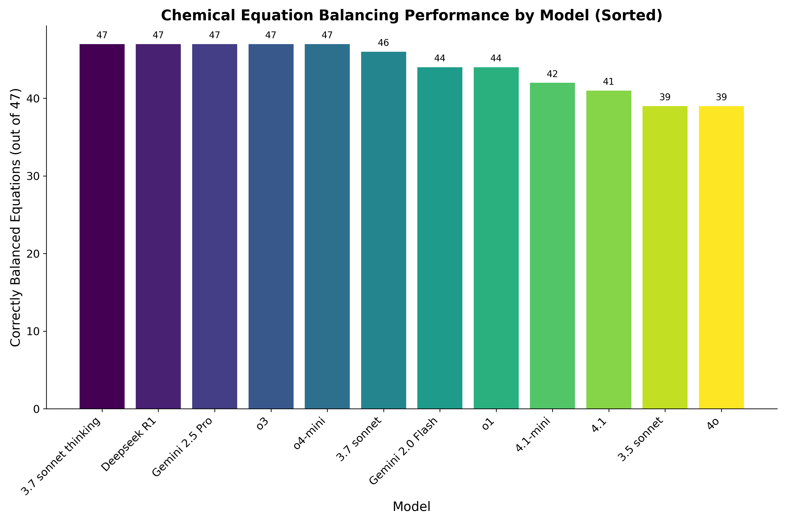

# Chemical Equation Balancing Benchmark

This project provides a deterministic benchmark for evaluating the ability of large language models to balance chemical equations.

## Data

The `data.json` file contains a list of chemical equations and their corresponding smallest positive integer coefficients.

## Prompt

The `prompt.txt` file contains the specific prompt to be used when querying the language model.

## Benchmark Results

The following table summarizes the performance of various language models on the chemical equation balancing task. The task consists of 47 equations.

| Model                 | Correctly Balanced | Accuracy (%) |
|-----------------------|--------------------|--------------|
| o3                    | 47/47              | 100.00%      |
| o4-mini               | 47/47              | 100.00%      |
| 3.7 sonnet thinking   | 47/47              | 100.00%      |
| Gemini 2.5 Pro        | 47/47              | 100.00%      |
| 3.7 sonnet            | 46/47              | 97.87%       |
| o1                    | 44/47              | 93.62%       |
| Gemini 2.0 Flash      | 44/47              | 93.62%       |
| 4.1-mini              | 42/47              | 89.36%       |
| 4.1                   | 41/47              | 87.23%       |
| 4o                    | 39/47              | 82.98%       |
| 3.5 sonnet            | 39/47              | 82.98%       |

### Performance Visualization (Image)

## Key Findings

*   Several models, including o3, o4-mini, 3.7 sonnet thinking, and Gemini 2.5 Pro, demonstrated perfect accuracy in balancing all 47 chemical equations.
*   A noticeable performance tiering is evident, with models like 3.7 sonnet, o1, and Gemini 2.0 Flash showing high accuracy, followed by others with slightly lower, yet still strong, performance.
*   The "thinking" variant of the "3.7 sonnet" model achieved a perfect score, outperforming its base counterpart.
